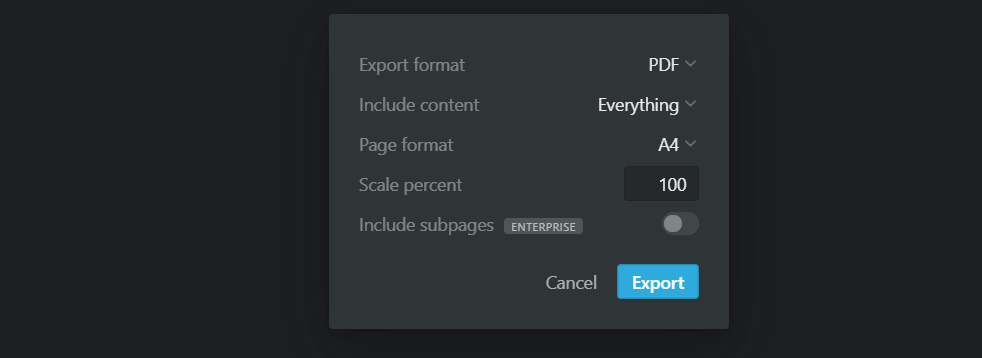
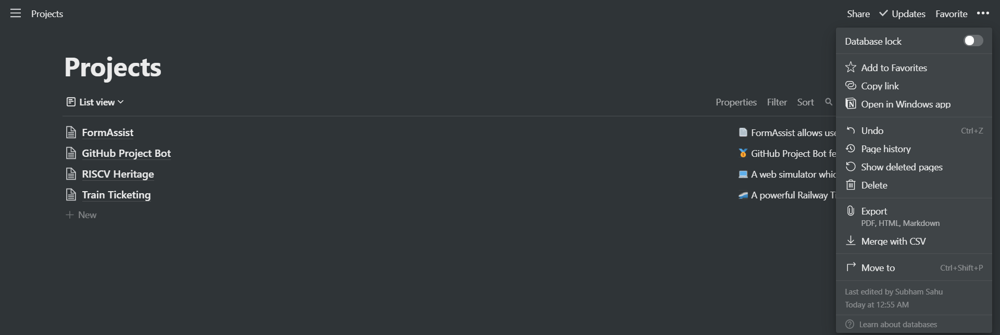

# Notion to Ebook

**Notion to Ebook** is a lightweight application written in Typescript to convert any notion database consisting of multiple nested documents or databases into an ebook with table of contents, cover, headers etc.

## Use Cases
1. Say you have a notion database containing many documents, and you wish to export them into a single PDF. Notion doesn't allow non-enterprise uses to include all the subpages into a single PDF recursively. But this application lets you generate it without any hassle, and even on a basic plan. :)

2. Say you have an e-reader like Kindle would like to send all the articles you have written on Notion workspace every 24 hours automatically. **Notion to Ebook** can help you in it. :)

## What's unique?
This application requires Zero Configuration. The current implementation does most things like arranging all the files as chapters and generating the Table of Contents, cover page, footer, etc. 

## Get Notion To Ebook

> We will be integrating with Notion API very soon which will perform this export task for you! 😎 For now we need to manually serve the data to the application.


Before moving further ensure that you completed the following two steps:

1. Go to your notion database and request for export in HTML. Ensure that you have selected "Include Subpages".
<p align="center">
    
    
</p>
2. Now Download and Extract it. On Linux, you may use the unzip to extract the files.

```bash
unzip Export-axe9879b-b2ef-4e87-8e6d-14vy.zip # Change the name
```

### Build from Source

1. Clone the repository

```
git clone [UPSTREAM_URL | FORKED_URL]
```

2. Add all the extracted HTML files in the data/ folder at the root of the application.
   Install the dependencies

```bash
npm i
```

3. Build the source code.

```bash
npm run build
```

4. Run the application

```bash
npm start
```

5. Wait for a while, and you will be able to see the full PDF in the `output/` directory!

### [Upcoming] Using the Hosted Cloud Server

We will soon have a web interface that will export all the core functionalities.
The web interface will enable new users to test the functionality with some dummy data, will make the application more accessible and convenient for many people.

### [Upcoming] Using Native Binaries

We will soon have the compiled source code, its dependencies as a binary for all the major platforms. Just install on the local PC and enjoy! 🚀

## Example
Here is the Notion Database [link](https://periodic-pike-2ed.notion.site/920be5e64bd04f34b3c4450ad3fcc80e).
Notion to Ebook will enable you to get [this](./_docs/prime_book.pdf). Great isn't it? 🎉

## Contributing

This project welcomes contributions and suggestions. Feel free to report bugs and suggest features. It will help us improve this project. ⚡⚡
